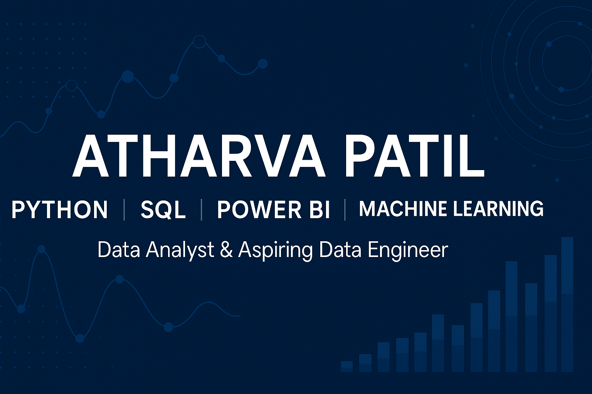

<!-- Banner -->

# 👋 Hi, I'm Atharva Patil  

**MSc Data Analytics | Data Analyst & Aspiring Data Engineer**  
Ireland 🇮🇪 | Python • SQL • Power BI • Machine Learning • Data Engineering  

---

## 🚀 About Me  
I’m passionate about turning raw data into meaningful insights and building scalable data solutions.  
Currently, I’m focused on developing real-world data analytics projects while expanding my skills in cloud platforms and ETL pipelines.  

- 🎯 **Goal:** Land a Data Analyst / Data Engineer role in Ireland  
- 💡 **Strengths:** Analytical thinking, problem-solving, and delivering actionable insights  
- 📚 **Currently Learning:** Azure Data Factory, Databricks, Advanced Power BI  

---

## 🛠 Tech Stack  
**Languages & Tools**  
  
  
  
  
  
  

---

## 📂 Featured Projects  

| Project | Description | Tech Stack | Repo |
|---------|-------------|------------|------|
| **Loan Defaulter Prediction** | Predicts high-risk borrowers using ML models & class balancing techniques | Python, Pandas, Scikit-learn, XGBoost | [View Repo](https://github.com/AtharvaPatilData/Loan-defaulter-risk-model) |
| **Power BI Sales Dashboard** | Interactive sales analytics dashboard with KPIs & trends | Power BI, DAX, Excel | *(To be added)* |
| **SQL Data Analysis** | Complex queries for business insights | SQL, PostgreSQL | *(To be added)* |

---

## 📊 GitHub Stats  

  

---

## 📫 Connect With Me  
)  
📧 **Email:** atharva0186@gmail.com  

---
*Let’s transform data into impactful decisions!*
